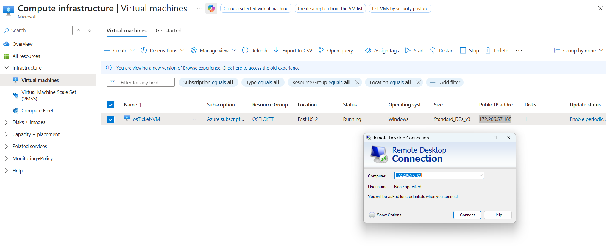

  

<h1 align="center">
osTicket Help Desk Deployment – Prerequisites & Installation on Azure
</h1>

<h3 align="center">
Microsoft Azure Windows VM | IIS | PHP | MySQL
</h3>

  
  
  
  
  
  
  

---

## 📋 Project Overview

**Project Type:** Infrastructure Deployment & Application Implementation  
**Status:** Complete and Fully Operational  
**Business Use Case:** Centralized help desk ticketing system for managing IT support requests in a cloud-based environment

This project demonstrates the complete deployment of **osTicket**, an open-source help desk ticketing system, hosted on **Microsoft Azure**. The implementation includes provisioning a Windows-based Azure Virtual Machine, configuring IIS with PHP support, deploying a MySQL database backend, and validating the system through end-user and administrator workflows.

This project was completed as a **portfolio-ready implementation** designed to reflect real-world help desk and IT support environments.

---

## 🖥️ Environments & Technologies Used

- Microsoft Azure (Virtual Machines)
- Windows 11 Pro (Azure VM)
- Internet Information Services (IIS) with CGI
- PHP 7.3
- MySQL 5.5
- Remote Desktop Protocol (RDP)
- PowerShell (administration & validation)

---

## ⚙️ osTicket Prerequisites

Before installing osTicket, the following components were required and configured:

1. Azure-hosted Windows Virtual Machine
2. IIS web server with CGI enabled
3. PHP runtime configured and registered in IIS
4. MySQL database server for ticket storage
5. Required PHP extensions (IMAP, Intl, OPcache)
6. Proper file permissions and security configuration

---

## 🛠️ Installation & Configuration Steps

  

Provisioned a Windows 11 Pro virtual machine in Microsoft Azure and connected via Remote Desktop to perform all installation and configuration tasks.

 

  

Installed and configured IIS with CGI support, registered PHP within IIS, and enabled required PHP extensions to meet osTicket application requirements.

 

  

Deployed osTicket into the IIS web root, configured the database connection, completed the web-based installer, and verified successful operation.

---

## 🎥 Demonstration

- Verified end-user ticket submission via the osTicket user portal  
- Logged into the staff control panel to manage and respond to tickets  
- Confirmed database connectivity and persistent ticket storage  
- Validated proper permissions and removed installation files post-deployment  

**Admin Portal:**  
`http://localhost/osTicket/scp/login.php`

**End User Portal:**  
`http://localhost/osTicket/`

---

## 🔐 Post-Deployment Cleanup & Security

- Removed osTicket setup directory
- Restricted permissions on `ost-config.php`
- Verified IIS and PHP configuration stability

---

## 🧠 Skills Demonstrated

- Azure Virtual Machine provisioning and management
- IIS web server administration
- PHP runtime installation and configuration
- MySQL database deployment and validation
- osTicket system deployment and testing
- Basic system hardening and post-install cleanup
- Troubleshooting dependencies and application issues

## ✅ Outcome

The osTicket help desk system was successfully deployed in a cloud-hosted Azure environment and is fully functional for handling support requests. This project demonstrates practical skills in cloud infrastructure, Windows administration, web server configuration, and help desk system deployment.
